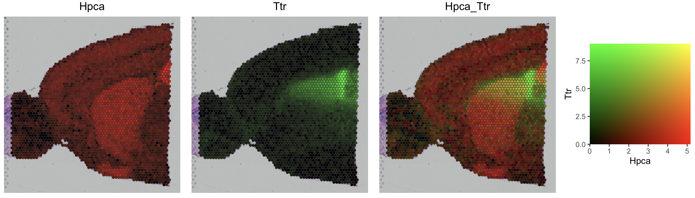
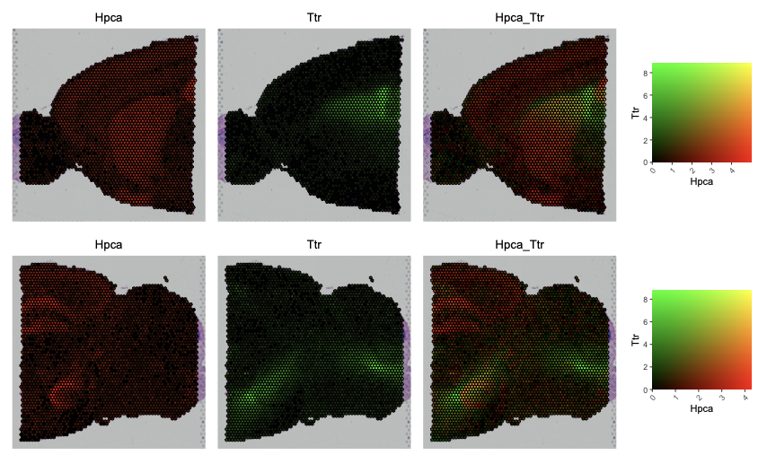
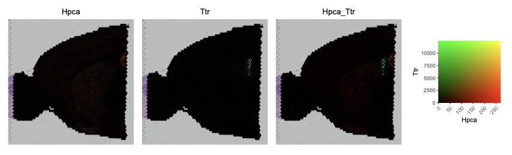
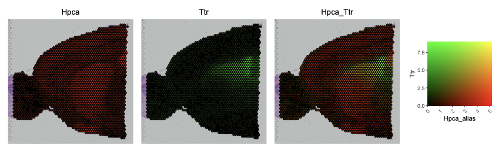

# SpatialFeaturePlotBlend

An implementation of Seurat's `SpatialFeaturePlot` that allows the expression
of two features to be displayed simultaneously and in relation to one another.

## Code

Available in [SpatialFeaturePlotBlend.R](SpatialFeaturePlotBlend.R).

## Usage

Using the `brain` dataset from the [Seurat spatial
vignette](https://satijalab.org/seurat/articles/spatial_vignette), we can use
`SpatialFeaturePlotBlend` as follows: 

```R
library(Seurat)
library(ggplot2)
library(dplyr)
library(patchwork)

SpatialFeaturePlotBlend(brain, "Hpca", "Ttr")
```



## Other options

### Multiple images

A `Seurat` object containing multiple images can be used as follows:

```R
# brain_merged has two images: anterior1 and posterior1
SpatialFeaturePlotBlend(brain_merged, "Hpca", "Ttr")
```



### Non-default assays

Non-default assays can be plotted using the `assay` argument:

```R
SpatialFeaturePlotBlend(brain, "Hpca", "Ttr", assay = "Spatial")
```



### Alternative feature names

Alternative names for `column_1` and `column_2` can be passed as
`column_1_alt_name` and `column_2_alt_name`, respectively. Currently, these
alternative names are only used in labelling the legend.

```R
SpatialFeaturePlotBlend(brain, "Hpca", "Ttr", column_1_alt_name = "Hpca_alias")
```



## Licensing

<details>
<summary>Click to reveal licensing information</summary>
    Copyright (C) 2024 University College London, licensed under GNU General
    Public License v3.0.

    This program is free software: you can redistribute it and/or modify it
    under the terms of the GNU General Public License as published by the Free
    Software Foundation, either version 3 of the License, or (at your option)
    any later version.

    This program is distributed in the hope that it will be useful, but WITHOUT
    ANY WARRANTY; without even the implied warranty of MERCHANTABILITY or
    FITNESS FOR A PARTICULAR PURPOSE.  See the GNU General Public License for
    more details.

    You should have received a copy of the GNU General Public License along
    with this program.  If not, see <http://www.gnu.org/licenses/>.
</details>
