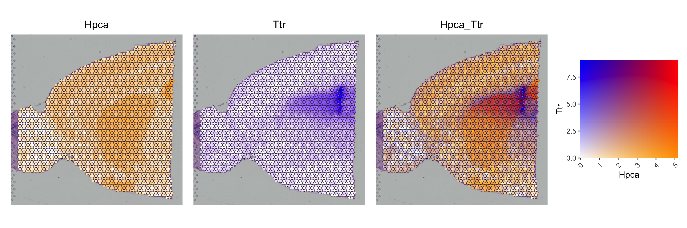

# SpatialFeaturePlotBlend

An implementation of Seurat’s `SpatialFeaturePlot` that allows the
expression of two features to be displayed simultaneously and in
relation to one another.

## Code

Available in [SpatialFeaturePlotBlend.R](SpatialFeaturePlotBlend.R).

## Usage

We use the `brain` dataset from the Seurat spatial vignette as an
example dataset. Click to reveal its processing.

    brain <- SeuratData::LoadData("stxBrain", type = "anterior1")
    brain <- Seurat::SCTransform(brain, assay = "Spatial", verbose = FALSE)

    library(Seurat)
    library(ggplot2)
    library(dplyr)
    library(patchwork)
    source("SpatialFeaturePlotBlend.R")

    SpatialFeaturePlotBlend(object = brain, features = c("Hpca", "Ttr"))

## Other options

### Custom colors

You can choose which colors to use by specifying them as follows:

        SpatialFeaturePlotBlend(object = brain, features = c("Hpca", "Ttr"),
                                top_left = "blue", bottom_right = "orange",
                                bottom_left = "white", top_right = "#FF0000")

### Multiple images

A `Seurat` object containing multiple images can be used as follows:

We load another member of the `brain` dataset. Click to reveal its
processing.

    brain2 <- SeuratData::LoadData("stxBrain", type = "posterior1")
    brain2 <- Seurat::SCTransform(brain2, assay = "Spatial", verbose = FALSE)

    brain_merged <- merge(x = brain, y = brain2)
    SpatialFeaturePlotBlend(object = brain_merged, features = c("Hpca", "Ttr"))

Note that the color scales of each image are independent.

### Non-default assays

Non-default assays can be plotted using the `assay` argument:

    SpatialFeaturePlotBlend(object = brain, features = c("Hpca", "Ttr"),
                            assay = "Spatial")

### Alternative feature names

Alternative names for `feature_1` and `feature_2` can be passed as
`feature_1_alt_name` and `feature_2_alt_name`, respectively. Currently,
these alternative names are only used in labelling the legend.

    SpatialFeaturePlotBlend(object = brain, features = c("Hpca", "Ttr"),
                            feature_1_alt_name = "Hpca_alias")

### Additional arguments

Additional arguments can be passed to the underlying plotting functions.
For example, we can change `alpha`:

    SpatialFeaturePlotBlend(object = brain, features = c("Hpca", "Ttr"),
                            alpha = 0.5)

## Bugs

There are probably bugs in this implementation and it has not been
rigorously tested, so please use at your own risk! If you do identify a
bug, please submit it as an issue
[here](https://github.com/george-hall-ucl/SpatialFeaturePlotBlend/issues).

## Licensing

Click to reveal licensing information

    Copyright (C) 2024 University College London, licensed under GNU General
    Public License v3.0.

    This program is free software: you can redistribute it and/or modify it
    under the terms of the GNU General Public License as published by the Free
    Software Foundation, either version 3 of the License, or (at your option)
    any later version.

    This program is distributed in the hope that it will be useful, but WITHOUT
    ANY WARRANTY; without even the implied warranty of MERCHANTABILITY or
    FITNESS FOR A PARTICULAR PURPOSE.  See the GNU General Public License for
    more details.

    You should have received a copy of the GNU General Public License along
    with this program.  If not, see <http://www.gnu.org/licenses/>.

